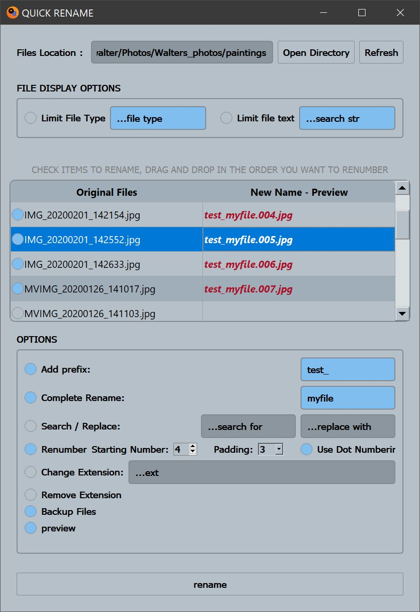

# QuickRename
Quick Rename is a Python based file renaming tool.

## Interface Images:

## Usage Requirements:
This application requires that you have PySide2 installed on your system. 

QuickShare was written utilizing Python 3.8 and will require at minimum python 3.6 as it uses 
f-string.

## Opening QuickRename
1. place the quick_rename package on your machine.
2. open a shell, navigate to the directory where the file exists and type:
 
 `python quick_rename_controller.py`

## Renaming files
1. After calling the command to open QuickRename a gui should open, which looks like the image above.
2. select the directory where your files live by pressing `Open Directory` and selecting the folder where your files 
   exist.  Once selected the files in that directory should populate in the main table.
3. To rename select the items you want to rename.
4. ** If renumbering drag them in the order you want to rename them.
4. Select and configure rename options. As you update these options the preview should show what the new name will look
   like.
5. Press rename if you are happy with the preview results.

## Options
- **Add Prefix** - This will add a prefix to all selected files.
- **Complete Rename** - This will completely rename the selected files.
  - This should be used in conjunction with renumber since complete rename will assign the same name to all selected files.
- **Search and Replace** - Search for a substring in all selected files and replace with a new string.
- **Renumber** - Renumber files based on their order in the list.
  - Drag and reorder files to change the numbering order.
- **Change Extension** - Replace extension of files.
- **Remove Extension** - Completely remove extension of files.
- **Backup** - Backup files before renaming.
  - This will add a backup folder to the existing file where the rename happens.
- **Preview** - Preview file name change before renaming.

## History
###1.0.0 
- Original release of QuickRename.

###2.0.0 
- Refactored, complete restructure of code.
- Migrated to **Python 3.8**
- Migrated to **PySide2**
- Backups are now stored in a folder based on the date of the rename to mitigate stomping old backups.
        

